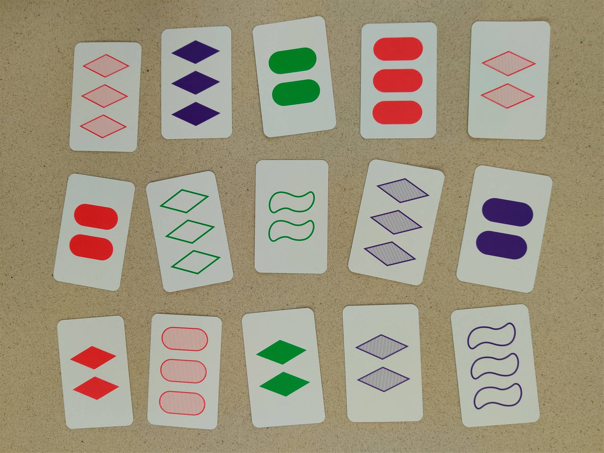
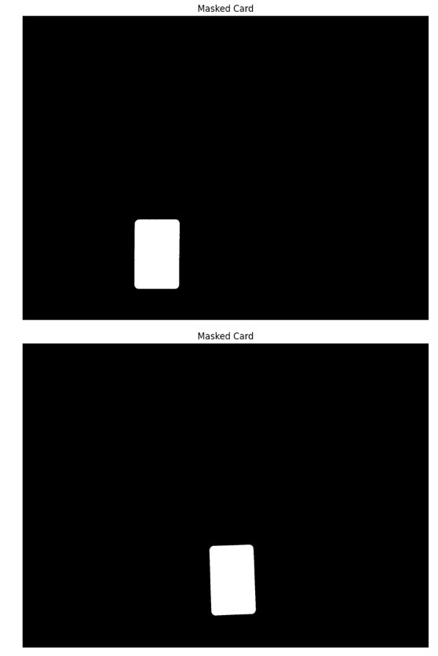
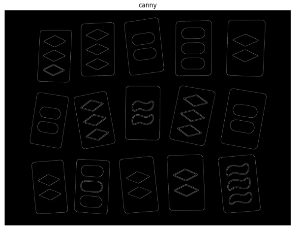
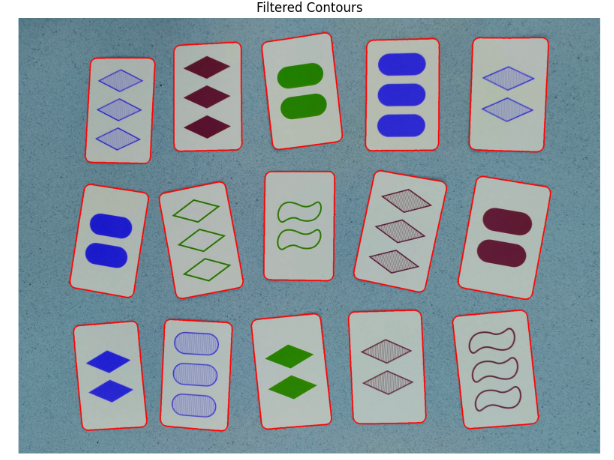
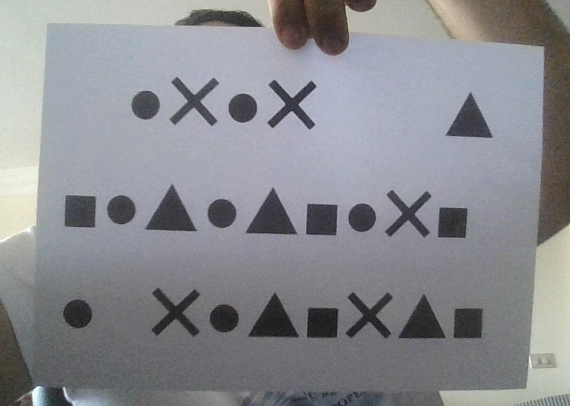
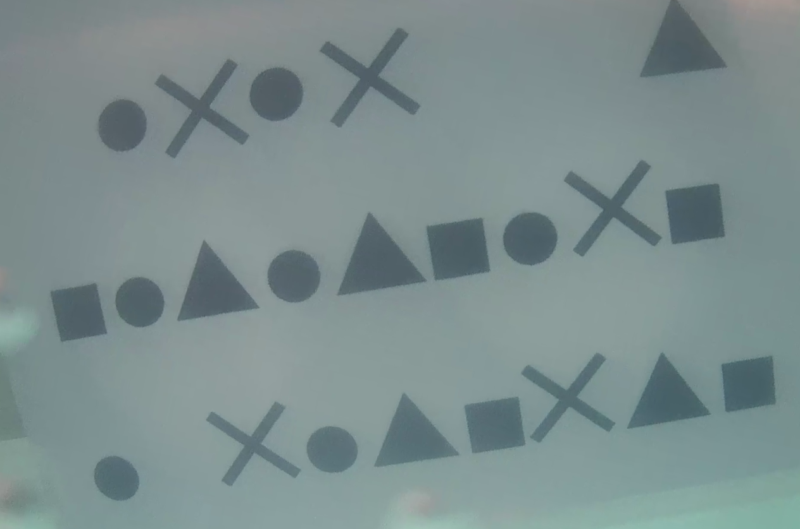
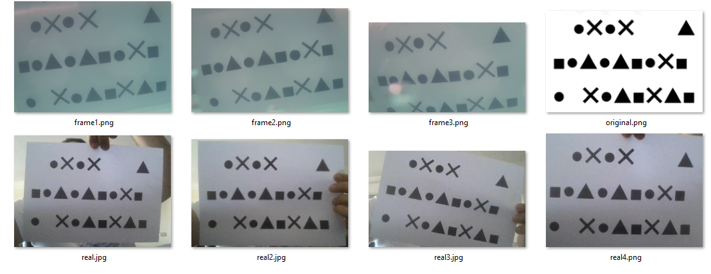
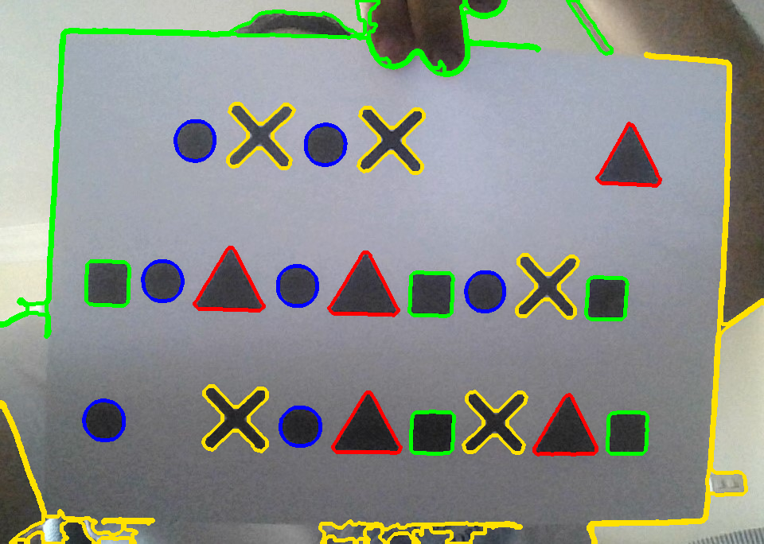
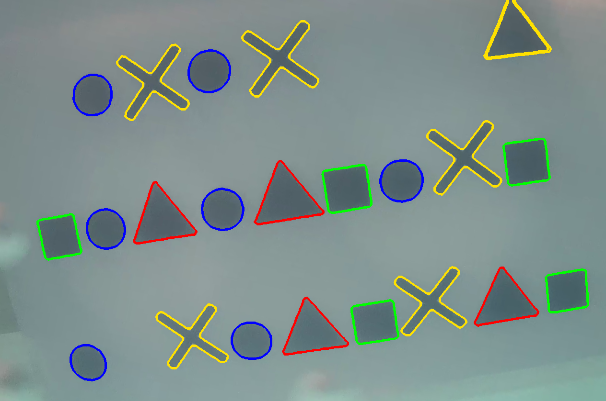
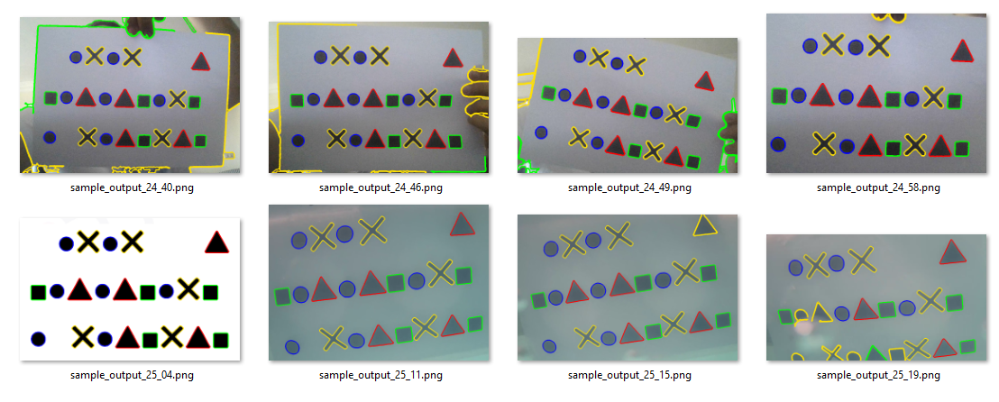

# OpenCV Shape & Object Detection

Classical computer vision pipelines for **object segmentation** and **geometric shape detection**
using OpenCV, focusing on robustness under noise, varying lighting, and real‑world conditions.

---

## Project Overview

This repository contains a set of **computer vision tasks** implemented using **OpenCV**
to explore image preprocessing, contour analysis, and geometric shape classification.

The project emphasizes:
- Classical CV techniques (no deep learning)
- Step‑by‑step image processing pipelines
- Visual and interpretable results

The main value of this repository lies in **Task 2** and **Task 3**, which demonstrate
complete object detection pipelines applied to real images.

---

## Tasks Summary

### Task 1 — Basic Image Handling *(Introductory)*
- Simple image loading and visualization
- Used as a warm‑up exercise  
*(Not a main focus of this repository)*

---

### Task 2 — Card Detection & Segmentation

**Goal:** Detect and isolate playing cards from an image using contour‑based segmentation.

#### Pipeline
1. Convert image to grayscale
2. Apply Gaussian & Median Blurring
3. Canny Edge Detection
4. Contour Detection
5. Area‑based filtering
6. Mask creation for each detected card

#### Output
- Each card is segmented using an individual contour mask
- Applied on **multiple real input images**
- Handles rotation, perspective, and background texture

---

### Task 3 — Geometric Shape Detection & Classification

**Goal:** Detect and classify geometric shapes under noisy and imperfect conditions.

#### Shapes Detected
- Triangle
- Square / Rectangle
- Circle
- X-Shape

#### Pipeline
1. Grayscale conversion
2. Noise reduction (Gaussian + Median Blur)
3. Canny Edge Detection
4. Morphological Closing
5. Dilation
6. Contour Detection
7. Shape classification based on:
   - Polygon approximation (`approxPolyDP`)
   - Aspect ratio
   - Circularity
   - Contour convexity

#### Output
- Detected shapes are **color‑coded**
- Final results are saved with **timestamped filenames**
- Designed to handle lighting variation and partial noise

---

## Example Results

### Task 2 — Card Segmentation

**Input Image**



**mask card example**



**Detected Card Masks**
```
assets/task2/output_mask_1.png
assets/task2/output_mask_2.png
```



---

### Task 3 — Shape Detection

**Input**






**Output (Color‑coded Shapes)**





> The outputs highlight detected contours and their inferred geometric class.

---

## Project Structure

```
.
├── Task1/                 # Introductory image handling
├── Task2/                 # Card detection & segmentation
├── Task3/                 # Geometric shape detection
├── README.md
└── requirements.txt       # OpenCV, NumPy, Matplotlib
└── assets/                # Input images and output masks for Task 2 and Task 3

```


## Technologies Used

- Python
- OpenCV
- NumPy
- Matplotlib

---

## Notes

- This project uses **classical computer vision** techniques exclusively.
- Evaluation is **qualitative**, supported by visual inspection.
- The focus is on interpretability and robustness rather than accuracy metrics.

---

> This project was implemented as part of hands‑on exploration of classical computer vision techniques.

---

## Author

**Abdelrhman Anwar**  
Data Engineer  

📧 **Email:** abd.ahm.anwar@gmail.com  
🔗 **LinkedIn:** https://www.linkedin.com/in/abdelrhman-anwar

---
